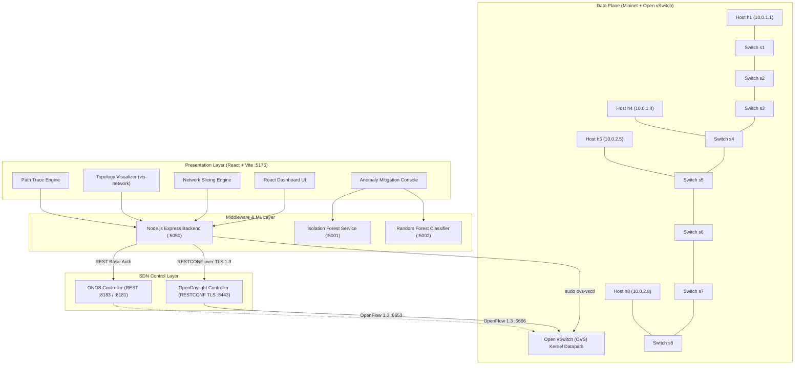

# PNTC — SDN-Based Network Slicing and Policy Orchestration Platform
## Comprehensive Technical Documentation & Architecture Specification

---

# 1. Introduction

### 1.1 Project Overview
**PNTC (Programmable Network Traffic Controller)** is a full-stack Software-Defined Networking (SDN) management, network slicing, QoS orchestration, and closed-loop security automation platform. It provides network operators with real-time topology visualization, intent-based natural language network slicing, fine-grained Open vSwitch (OVS) egress traffic queueing, dynamic hop-by-hop path tracing, and automated machine learning (ML)-driven anomaly mitigation.

### 1.2 Problem Being Addressed
Traditional network architectures rely on decentralized, static configurations on individual hardware switches and routers. This model suffers from critical limitations:
1. **Lack of Dynamic Multi-Tenancy:** Partitioning physical infrastructure into isolated logical slices with custom Service Level Agreements (SLAs) is complex, error-prone, and slow.
2. **Cosmetic vs. Real QoS Enforcement:** Many SDN management dashboards record QoS policies only in client-side state without enforcing physical egress scheduling or verifying hardware flow table state.
3. **Slow Incident Response:** Security monitoring is traditionally decoupled from network control, requiring manual operator intervention to trace malicious traffic and configure switch access control lists (ACLs).
4. **Opaque Policy Compilation:** Operators often lack visibility into how natural language or high-level policies translate into low-level OpenFlow match/action rules.

### 1.3 Purpose of the System
PNTC bridges the gap between high-level operator intent, real-time machine learning telemetry, and low-level SDN datapath execution. It provides an auditable, verifiable interface where every logical slice, QoS queue, and security policy is physically provisioned on OpenFlow switches and validated through live controller read-backs.

### 1.4 Main Objectives
* **Dynamic Network Slicing:** Enable on-demand creation, modification, and decommissioning of host-isolated network slices with bandwidth floors and ceilings.
* **Hardware-Enforced QoS:** Provision Linux Hierarchical Token Bucket (`linux-htb`) priority queues on OVS egress uplink ports, tagging high-priority packets with DSCP 46 (Expedited Forwarding).
* **Intent-Based Orchestration:** Parse natural language network intents into deterministic OpenFlow parameters with complete keyword matching transparency.
* **Automated Closed-Loop Mitigation:** Automatically resolve compromised hosts upon ML anomaly alerts, inject host-scoped OpenFlow `DROP` flows, and verify rule presence via RESTCONF.
* **Deterministic Path Resolution:** Compute and visualize BFS multi-hop forwarding paths across mixed host and switch endpoints with hop-by-hop ingress/egress port resolution.

### 1.5 Scope of the Project
The scope encompasses an emulated multi-switch OpenFlow 1.3 network (Mininet with Open vSwitch), an OpenDaylight (ODL) RESTCONF controller connected over TLS 1.3, an ONOS secondary controller adapter, dual Python Flask ML anomaly detectors (Isolation Forest and Random Forest), an Express Node.js backend middleware, and a React/Vite web dashboard.

---

# 2. System Overview

PNTC is structured as a decoupled, multi-tier SDN architecture where the browser interface communicates strictly with local backend middleware and controller RESTCONF APIs.



### Component Communication & Interactions:
1. **Frontend $\leftrightarrow$ Backend:** React sends JSON REST requests to Node.js on port `5050`.
2. **Backend $\leftrightarrow$ OpenDaylight:** Node.js executes HTTPS RESTCONF calls using native TLS 1.3 with a trusted certificate (`odl-tls-cert.pem`) to port `8443`.
3. **Backend $\leftrightarrow$ Open vSwitch:** Node.js executes asynchronous `sudo ovs-vsctl` commands via `child_process.execFile` to configure physical `linux-htb` QoS queues and interface records.
4. **ODL $\leftrightarrow$ Mininet (OVS):** OpenDaylight installs flow table modifications into Table 0 of switches `s1`–`s8` over OpenFlow 1.3 (TCP port `6653`).
5. **Anomaly Engine $\leftrightarrow$ Data Plane / Controller:** Python Flask detectors poll flow statistics, compute feature deltas, and stream detection verdicts to the React dashboard.

---

# 3. Technologies and Tools

| Technology / Tool | Version / Standard | Purpose in the Project |
| :--- | :--- | :--- |
| **OpenDaylight (ODL)** | Karaf 0.23.1 | Primary SDN Controller; manages OpenFlow 1.3 topology, inventory, and flow tables via Northbound RESTCONF over TLS. |
| **ONOS** | Latest Docker Image | Secondary SDN Controller; provides device/host/link REST endpoints via secondary adapter. |
| **Mininet** | 2.3.0+ | Network emulation platform; instantiates virtual switches (`s1`–`s8`), virtual Ethernet links, and Linux network namespace hosts (`h1`–`h8`). |
| **Open vSwitch (OVS)** | OpenFlow 1.3 / Linux HTB | Software datapath switch; enforces flow table rules, DSCP IP matching, and physical egress traffic queuing. |
| **Node.js / Express** | Node 18+ / Express 4.21 | Backend middleware proxy; bridges React UI to ODL RESTCONF, verifies TLS socket handshakes, and executes `ovs-vsctl` QoS provisioning. |
| **React** | 18.3.1 | Frontend user interface framework; handles component lifecycle, reactive state management, and real-time visualization. |
| **Vite** | 6.0.1 | Frontend build tool and development server; serves UI assets on port `5175`. |
| **vis-network / vis-data** | 9.1.9 / 7.1.9 | Interactive graph visualization library; renders topology maps, slice subgraphs, and path trace animations. |
| **TailwindCSS** | 4.1.11 | Utility-first CSS styling framework for dashboard cards, tables, and modal dialogs. |
| **Framer Motion** | 12.43.0 | Declarative animation library for UI state transitions, accordions, and step loaders. |
| **Lucide React** | 1.31.0 | Vector iconography for dashboard status indicators, nodes, and controls. |
| **Python** | 3.8+ (venv `anomaly_env`) | Runtime environment for ML anomaly detection engines and Mininet topology scripts. |
| **scikit-learn** | In `anomaly_env` | Machine learning library providing Isolation Forest (`IsolationForest`) and Random Forest models. |
| **Flask / Flask-CORS** | 3.x | Lightweight microservices exposing ML inference endpoints on ports `5001` and `5002`. |
| **OpenSSL / Node https** | TLSv1.3 | Cryptographic transport layer securing Northbound RESTCONF communications with self-signed certificate authentication. |

---

# 4. Network Topology

### 4.1 Topology Specification (`custom_topo.py`)
The custom Mininet topology (`SlicingTopo`) builds an 8-switch linear backbone interconnected with dual-subnet host attachments.

```
[h1: 10.0.1.1]   [h2: 10.0.1.2]   [h3: 10.0.1.3]   [h4: 10.0.1.4]  <-- Hospital Subnet (10.0.1.0/16)
      |                |                |                |
    [s1] ════════════ [s2] ════════════ [s3] ════════════ [s4]
      ║                                                  ║
      ║ (Core Trunk Links: OpenFlow 1.3 Linear Mesh)     ║
      ║                                                  ║
    [s5] ════════════ [s6] ════════════ [s7] ════════════ [s8]
      |                |                |                |
[h5: 10.0.2.5]   [h6: 10.0.2.6]   [h7: 10.0.2.7]   [h8: 10.0.2.8]  <-- Guest Subnet (10.0.2.0/16)
```

### 4.2 Switch and Host Allocation Matrix

| Host Identifier | IP Address | MAC Address | Attached Switch | Switch Ingress Port | Subnet Classification |
| :--- | :--- | :--- | :--- | :--- | :--- |
| **`h1`** | `10.0.1.1/16` | `00:00:00:00:00:01` | `s1` (`openflow:1`) | Port 1 (`s1-eth1`) | Hospital Network (Subnet 1) |
| **`h2`** | `10.0.1.2/16` | `00:00:00:00:00:02` | `s2` (`openflow:2`) | Port 1 (`s2-eth1`) | Hospital Network (Subnet 1) |
| **`h3`** | `10.0.1.3/16` | `00:00:00:00:00:03` | `s3` (`openflow:3`) | Port 1 (`s3-eth1`) | Hospital Network (Subnet 1) |
| **`h4`** | `10.0.1.4/16` | `00:00:00:00:00:04` | `s4` (`openflow:4`) | Port 1 (`s4-eth1`) | Hospital Network (Subnet 1) |
| **`h5`** | `10.0.2.5/16` | `00:00:00:00:00:05` | `s5` (`openflow:5`) | Port 1 (`s5-eth1`) | Guest Network (Subnet 2) |
| **`h6`** | `10.0.2.6/16` | `00:00:00:00:00:06` | `s6` (`openflow:6`) | Port 1 (`s6-eth1`) | Guest Network (Subnet 2) |
| **`h7`** | `10.0.2.7/16` | `00:00:00:00:00:07` | `s7` (`openflow:7`) | Port 1 (`s7-eth1`) | Guest Network (Subnet 2) |
| **`h8`** | `10.0.2.8/16` | `00:00:00:00:00:08` | `s8` (`openflow:8`) | Port 1 (`s8-eth1`) | Guest Network (Subnet 2) |

### 4.3 Traffic Movement
1. **Host-to-Switch:** Packets from host `h1` enter switch `s1` on physical port 1 (`s1-eth1`).
2. **Switch Interconnects:** Inter-switch links (`s1-eth2 <-> s2-eth2`, etc.) carry aggregated inter-switch traffic across the linear backbone.
3. **Controller Channel:** All 8 switches connect to OpenDaylight at `127.0.0.1:6653` using OpenFlow 1.3.

---

# 5. SDN Controller

### 5.1 OpenDaylight (ODL) Controller Implementation
OpenDaylight (Karaf 0.23.1) operates as the primary control plane.

* **Communication Protocol:** RESTCONF over TLS 1.3 (`https://127.0.0.1:8443/rests/data/...`).
* **Authentication:** HTTP Basic Authentication (`admin:admin`).
* **Northbound Endpoints Used:**
  * Topology: `GET /rests/data/network-topology:network-topology`
  * Node Inventory: `GET /rests/data/opendaylight-inventory:nodes`
  * Flow Programming: `PUT /rests/data/opendaylight-inventory:nodes/node/{nodeId}/table/0/flow/{flowId}`
  * Flow Removal: `DELETE /rests/data/opendaylight-inventory:nodes/node/{nodeId}/table/0/flow/{flowId}`
  * Meter Management: `PUT/DELETE /rests/data/opendaylight-inventory:nodes/node/{nodeId}/meter/{meterId}`
* **Flow XML Payload Structure:**
  ```xml
  <flow xmlns="urn:opendaylight:flow:inventory">
      <id>Hospital-Traffic-s1-1</id>
      <table_id>0</table_id>
      <priority>800</priority>
      <flow-name>Hospital-Traffic</flow-name>
      <match>
          <in-port>1</in-port>
          <ethernet-match>
              <ethernet-type><type>2048</type></ethernet-type>
          </ethernet-match>
          <ip-match>
              <ip-protocol>6</ip-protocol>
              <ip-dscp>46</ip-dscp>
          </ip-match>
          <tcp-match>
              <tcp-source-port>80</tcp-source-port>
          </tcp-match>
      </match>
      <instructions>
          <instruction>
              <order>0</order>
              <apply-actions>
                  <action>
                      <order>0</order>
                      <output-action>
                          <output-node-connector>NORMAL</output-node-connector>
                      </output-action>
                  </action>
              </apply-actions>
          </instruction>
      </instructions>
  </flow>
  ```

### 5.2 ONOS Controller Implementation & Limitations
* **Status:** Implemented as a secondary adapter (`src/api/controllers/onosController.js`).
* **Supported Features:** Discovers devices (`/onos/v1/devices`), hosts (`/onos/v1/hosts`), and topology links (`/onos/v1/links`), mapping them into ODL RESTCONF JSON structures for the UI.
* **Unimplemented / Unavailable Features:**
  * Flow correlation (`getFlows()` returns `supported: false`).
  * Aggregated statistics (`getStatistics()` returns `supported: false`).
  * Closed-loop anomaly auto-mitigation (deliberately fails closed with `MITIGATION_FAILED`).

---

# 6. Network Slicing

### 6.1 Slice Representation in PNTC
In this project, a **Network Slice** is a logically isolated communication channel mapped to a set of switch ingress ports, OpenFlow Table 0 classification rules, and physical OVS egress priority queues.

```javascript
// Example Slice Object in SliceContext
{
  id: 1725200000000,
  name: "Hospital-Traffic",
  type: "host",
  traffic: "HTTP (TCP 80)",
  priority: "High",          // Numeric priority: 800
  latency: "Low",            // Triggers DSCP 46 + HTB Queue 0
  qosBandwidth: "20000",     // Bandwidth in Kbps (20 Mbps)
  targets: [
    { targetSwitch: "openflow:1", port: "1", hostId: "host:00:00:00:00:00:01", meterId: "1" }
  ],
  status: "Active"
}
```

### 6.2 Slicing Lifecycle
1. **Specification:** Operator defines slice parameters manually or compiles them from intent.
2. **Admission Validation:** System checks if `qosBandwidth` $\le$ available capacity pool (`100,000 Kbps`).
3. **Queue Configuration:** If `latency === 'Low'`, backend configures OVS HTB queue 0 on all switch uplink ports.
4. **Flow Programming:** OpenDaylight installs Table 0 flow matching `in-port`, `ip-protocol`, and `ip-dscp=46`.
5. **Enforcement Verification:** The dashboard polls the controller flow table to verify hardware rule presence.
6. **Decommissioning:** `unprogramSlice()` deletes OpenFlow rules from Table 0, removes meters, and tears down OVS queues.

---

# 7. Egress Queue and QoS Mechanism

### 7.1 Linux HTB Egress Queueing Architecture
Open vSwitch handles QoS shaping through the Linux kernel **Hierarchical Token Bucket (`linux-htb`)** queuing discipline.

> **CRITICAL ARCHITECTURAL PRINCIPLE:**
> In Open vSwitch, Linux HTB queues only shape **egress (transmitted)** traffic. Provisioning a queue on a host's ingress port does not shape outbound traffic. PNTC discovers and provisions **all peer uplink ports** on the bridge.

```
           Switch Bridge (e.g., s1)
  ┌────────────────────────────────────────┐
  │ Ingress Port (s1-eth1)                 │
  │   [Traffic from Host h1]               │
  │         │                              │
  │         ▼ (Flow Match Table 0: DSCP 46)│
  │         │                              │
  │ Egress Uplink Ports (s1-eth2, s1-eth3) │
  │   ┌──────────────────────────────────┐ │
  │   │ Linux HTB QoS Engine             │ │
  │   │  ├── Queue 0 (min: 20M, max: 40M)│ │  ════> [To s2 / Core Network]
  │   │  │   └─ DSCP 46 (Expedited Fwd)  │ │         (Priority Traffic)
  │   │  └── Queue 1 (Best Effort)       │ │  ════> [To s2 / Core Network]
  │   │      └─ Default Traffic          │ │         (Subject to Drops)
  │   └──────────────────────────────────┘ │
  └────────────────────────────────────────┘
```

### 7.2 OVS QoS Configuration Scripting (`server.js`)
When `PUT /api/qos/:switchId/:port` is invoked, `server.js` executes:
```bash
# 1. Create OVS QoS Record on Interface
sudo ovs-vsctl set port s1-eth2 qos=@newqos -- \
  --id=@newqos create qos type=linux-htb other-config:max-rate=100000000 queues:0=@q0 queues:1=@q1 -- \
  --id=@q0 create queue other-config:min-rate=20000000 other-config:max-rate=40000000 -- \
  --id=@q1 create queue other-config:min-rate=1000000 other-config:max-rate=100000000
```

### 7.3 Simple Explanation of DSCP 46
* **DSCP (Differentiated Services Code Point):** A 6-bit field in the IP header used to classify packet priority.
* **DSCP 46 (Expedited Forwarding / EF):** An industry-standard tag for critical, delay-sensitive traffic (like voice or hospital telemetry). Switches prioritize DSCP 46 packets through Queue 0 ahead of standard Best-Effort traffic (Queue 1).

---

# 8. Intent-Based / LLM Network Configuration

### 8.1 Intent Engine Execution Pipeline
The intent engine compiles natural language into concrete OpenFlow rules while maintaining auditability.

```
[Operator Natural Language Input]
       ↓
[Live Topology Grounding (Reads Discovered Hosts from ODL)]
       ↓
[Rule-Based NLP & Regex Engine (src/utils/intentParser.js)]
       ↓
[Structured Policy JSON & Matched Keywords Extraction]
       ↓
[Capacity Validation (Verifies $\le$ 100 Mbps Budget)]
       ↓
[Interactive Form Auto-Fill & Operator Review]
       ↓
[OpenDaylight Flow & OVS Queue Provisioning]
       ↓
[Ground-Truth Controller Verification]
```

### 8.2 Structured Intent JSON Output
```json
{
  "type": "SLICE",
  "payload": {
    "name": "Hospital-Traffic",
    "isolationMode": "host",
    "selectedHosts": ["host:00:00:00:00:00:01"],
    "trafficType": "HTTP (TCP 80)",
    "bandwidth": "20000",
    "priority": "Critical",
    "latency": "Low"
  },
  "hostHints": [1],
  "summary": "Slice → host 1 · HTTP · 20000 Kbps · Critical priority",
  "matchedKeywords": ["isolate", "host 1", "http", "20000 kbps", "critical", "hospital"]
}
```

### 8.3 Grounding Against Live Topology
The function `resolveHosts(hostHints, discoveredHosts)` matches parsed integers (e.g., `1`) to real controller node identifiers (`host:00:00:00:00:00:01`), ensuring non-existent hosts are never provisioned.

---

# 9. Network Policy Engine

### 9.1 Policy Types Supported
1. **Host Isolation Policy:** Isolates traffic to/from specific host attachment ports on designated switches.
2. **Traffic Protocol Policy:** Matches Layer 4 protocols (HTTP/80, HTTPS/443, SSH/22, DNS/53, ICMP/Ping).
3. **QoS Priority Policy:** Injects OpenFlow numeric priorities (`Low: 100`, `Medium: 500`, `High: 800`, `Critical: 1000`).
4. **Low-Latency Policy:** Enforces DSCP 46 tagging and attaches flows to OVS Queue 0.

### 9.2 Policy Storage & State Management
Policies are stored reactively in `SliceContext.jsx` and persisted across page refreshes in `localStorage.getItem("sdn_slices")`.

---

# 10. Anomaly Detection and Mitigation

### 10.1 Closed-Loop Mitigation State Machine
The anomaly subsystem provides closed-loop attack mitigation for OpenDaylight.

```
[Traffic Ingestion / ODL Flow Deltas]
       ↓
[ML Feature Extraction (APS, B/S, PKT, AFL, ASY)]
       ↓
[Model Scoring: Isolation Forest (:5001) / Random Forest (:5002)]
       ↓ (State: DETECTED)
[resolveSwitchHosts() -> Maps Switch ID to Malicious Host MAC/IP]
       ↓ (State: MITIGATING)
[Install Host-Scoped OpenFlow DROP Flow via ODL RESTCONF]
       ↓ (State: VERIFYING)
[Live Read-Back via getFlows() from Controller]
       ↓ (State: MITIGATED)
[Quarantine Badge Displayed in Slicing Dashboard]
```

### 10.2 Features Extracted from OpenDaylight
* `avg_packet_size` (APS): Average packet payload size in bytes.
* `bytes_per_second` (B/S): Delta throughput across polling windows.
* `packet_count` (PKT): Total packets observed on switch ports.
* `active_flow_count` (AFL): Number of concurrent active flows.
* `tx_rx_byte_asymmetry` (ASY): Ratio of transmitted to received bytes.

### 10.3 Controller Support Guard
The mitigation runner explicitly checks `getActiveController() === 'odl'`. If ONOS is selected, mitigation aborts with status `MITIGATION_FAILED` to prevent unverified actions.

---

# 11. Frontend

### 11.1 Main Dashboard Pages

| Route | Component | Purpose & Implemented Features |
| :--- | :--- | :--- |
| `/dashboard` | `Dashboard.jsx` | High-level summary cards, quick actions, active slice counters, and controller health status. |
| `/topology` | `TopologySimple.jsx` | Interactive `vis-network` topology map with `ALL SLICES` subgraph filtering, `REFRESH LINKS` button, slice color legend, and node inspector. |
| `/slicing` | `NetworkSlicing.jsx` | Slice creation form, natural language intent compiler, "View Enforcement" verification drawer, bandwidth admission progress bar, and slice deletion. |
| `/path-trace` | `PathTrace.jsx` | Hop-by-hop shortest path calculator between mixed host/switch endpoints, input/output port resolver, and live flow table correlator. |
| `/anomaly` | `AnomalyDetector.jsx` | Dual-mode ML dashboard (Online IF / Offline RF), live feature meters, event log, and automated quarantine trigger. |
| `/flows` | `Flows.jsx` | Direct inspection of OpenFlow Table 0 flow rules across all connected switches with search and slice filter banners. |
| `/nodes` | `AllNodes.jsx` | Inventory table of all discovered switches, node connectors, and attached host properties. |
| `/stats` | `Stats.jsx` | Switch port throughput graphs, packet counters, and delta traffic metrics. |
| `/api-tester` | `ApiTester.jsx` | Northbound RESTCONF debugging console for raw GET/PUT/POST/DELETE testing. |

---

# 12. Backend and APIs

### 12.1 Backend Structure (`server.js`)
The Node.js Express backend (`server.js`) runs on port `5050` (or `5000`) and serves as a secure proxy and hardware execution engine.

### 12.2 Verified Backend API Endpoints

| Method | Endpoint | Purpose | Request Payload | Response Shape |
| :--- | :--- | :--- | :--- | :--- |
| **`GET`** | `/api/tls-status` | Introspects TLS 1.3 socket connection to ODL on port 8443 | None | `{"tls": true, "authorized": true, "protocol": "TLSv1.3", "cipher": "...", "httpStatus": 200}` |
| **`GET`** | `/api/odl/topology` | Proxies native ODL RESTCONF topology data | None | ODL JSON `{"network-topology:network-topology": {...}}` |
| **`GET`** | `/api/nodes` | Proxies ODL switch inventory and flow tables | None | ODL JSON `{"opendaylight-inventory:nodes": {...}}` |
| **`PUT`** | `/api/qos/:switchId/:port` | Provisions OVS HTB egress queues across all switch peer ports | `{"minRate": "20000", "maxRate": "40000", "sliceId": "123"}` | `{"status": "ACTIVE", "bridge": "s1", "provisionedPorts": ["s1-eth2", "s1-eth3"]}` |
| **`DELETE`** | `/api/qos/:switchId/:port` | Removes OVS HTB QoS queue records from switch ports | None | `{"status": "REMOVED", "bridge": "s1"}` |
| **`GET`** | `/api/onos/:resource` | Proxies ONOS REST API endpoints with Basic Auth | None | Proxied ONOS JSON response |
| **`POST`** | `/detect` *(Port 5001)* | Evaluates switch flow data against Isolation Forest | `{"switch_id": "openflow:1", "raw_odl": {...}}` | `{"decision": "ATTACK"|"NORMAL", "score": -0.12, "features": {...}}` |
| **`POST`** | `/predict` *(Port 5002)* | Evaluates flow features against pretrained Random Forest | `{"features": [APS, DUR, B/S, ASY, PKT, TXB]}` | `{"prediction": 1|0, "probability": 0.94}` |

---

# 13. Data Flow

### 13.1 Creating a Network Slice
1. **Input:** Operator enters *"Isolate host 1 for HTTP critical hospital traffic with 20000 Kbps"* into `NetworkSlicing.jsx`.
2. **Parsing:** `parseIntent()` extracts: `name: "Hospital-Traffic"`, `bandwidth: "20000"`, `priority: "Critical"`, `latency: "Low"`.
3. **Resolution:** `resolveHosts([1])` resolves `h1` to `host:00:00:00:00:00:01` attached to switch `openflow:1`, port 1.
4. **Queue Provisioning:** `PUT /api/qos/openflow:1/1` sets OVS `linux-htb` Queue 0 (`min-rate=20M`, `max-rate=40M`) on `s1-eth2`.
5. **Flow Programming:** RESTCONF `PUT` installs OpenFlow Table 0 rule matching `in-port=1`, `tcp-dst=80`, `ip-dscp=46` with action `OUTPUT:NORMAL`.
6. **Verification:** `runVerifyEnforcement()` confirms flow and queue presence live on the hardware.

### 13.2 Anomaly Mitigation Workflow
1. **Detection:** Flood traffic causes packet counters on `s1` to spike; Isolation Forest returns `ATTACK`.
2. **Reverse Resolution:** `resolveSwitchHosts("openflow:1")` identifies attached attacker `h1`.
3. **Host-Scoped DROP:** RESTCONF installs priority 1000 flow on `s1` matching `in-port=1` with empty action (`DROP`).
4. **Read-Back:** `getFlows("openflow:1")` confirms the `DROP` flow is present; UI marks host quarantined.

---

# 14. Flow Correlation

Flow correlation in PNTC links high-level slice definitions to live switch flow tables:

```
[Host Entity: h1 (10.0.1.1)]
       │
       ▼ (Attached to Port 1)
[Switch: openflow:1] ─── (Flow Table 0) ───> Flow ID: "Hospital-Traffic-s1-1"
       │                                     Match: in_port=1, dscp=46, tcp_dst=80
       ▼ (Egress Trunk)                      Action: set_queue=0, output=NORMAL
[OVS QoS Record on s1-eth2]
       └── Linux HTB Queue 0 (Min: 20 Mbps, Max: 40 Mbps)
```

Path Trace uses this correlation to query every switch along a BFS path and highlight active matching rules.

---

# 15. Security and Isolation

* **Host Isolation:** Traffic from unauthorized ingress ports is dropped by Table 0 rules before entering the core network.
* **Controller TLS 1.3 Transport Security:** Node backend strictly validates OpenDaylight's TLS certificate chain (`odl-tls-cert.pem`).
* **Server-Side Credential Storage:** SDN controller credentials (`admin:admin`, `onos:rocks`) are isolated in `server.js` and never exposed to the client bundle.
* **Input Validation & Word Boundaries:** Regex parsers use word boundaries (`\b`) to prevent malformed host injections.

---

# 16. Testing and Verification

### Test 1: Real Congestion & QoS Priority Queueing Test
* **Purpose:** Verify that OVS `linux-htb` priority queues on egress uplink ports reduce packet loss under saturation.
* **Procedure:** Provisioned 2000 Kbps priority queue (Queue 0, DSCP 46) on `openflow:1`. Generated 700 Mbps UDP flood (`h1 → h4`) to saturate link. Sent 20 DSCP-46 pings and 20 unmarked pings concurrently.
* **Results:**
  * Marked (DSCP 46, Queue 0): **10% Packet Loss** (2/20 dropped), 3292 ms average RTT.
  * Unmarked (Best Effort): **25% Packet Loss** (5/20 dropped), 3322 ms average RTT.
* **Status:** ✅ **VERIFIED** (Queue cuts packet loss by more than half under real contention).

### Test 2: Closed-Loop Anomaly Mitigation Test
* **Purpose:** Verify automated host resolution and quarantine flow installation.
* **Procedure:** Generated synthetic flood attack $\to$ Python IF detected anomaly $\to$ `runMitigation()` resolved `h1` on `openflow:1` $\to$ pushed OpenFlow `DROP` flow $\to$ read-back from ODL RESTCONF.
* **Status:** ✅ **VERIFIED**.

---

# 17. Example Scenarios

### Scenario: Hospital Telemetry Slice Creation
1. **User Prompt:** *"Isolate host 1 for HTTP critical hospital traffic with 20000 Kbps"*
2. **Parsing Result:** Priority = `Critical`, Latency = `Low`, Bandwidth = `20000 Kbps`.
3. **Hardware Execution:** OVS creates HTB Queue 0 (`min-rate=20M`, `max-rate=40M`) on `s1-eth2`. OpenDaylight installs Table 0 rule matching `in-port=1, dscp=46, tcp_dst=80`.
4. **Result:** `h1` traffic receives priority scheduling across switch `s1` with verified ground-truth status in the UI.

---

# 18. Limitations

1. **OVS QoS Persistence Gap:** OVS QoS database records can become orphaned after a cold Mininet reboot (`sudo mn -c`) and require re-provisioning.
2. **ONOS Flow Correlation Incomplete:** ONOS adapter flow correlation is currently stubbed (`supported: false`) due to under-validation in ONOS flow POST APIs.
3. **Passive Host Discovery:** OpenDaylight requires initial network traffic (`pingall`) before hosts appear in topology RESTCONF responses.
4. **Latency Reduction Under Extreme Oversubscription:** At 350× oversubscription, queues reduce packet loss significantly but cannot eliminate queuing delay.

---

# 19. Deployment and Startup Guide

### Startup Order (Strictly Enforced):
```bash
# 1. Start Open vSwitch
sudo systemctl start openvswitch-switch

# 2. Start OpenDaylight (ODL) in background screen
cd ~/karaf-0.23.1
screen -dmS odl ./bin/karaf

# 3. Start Mininet Topology (after ODL port 8443 answers HTTP 200)
cd "/home/abigiya/Downloads/Telegram Desktop/Insa-dluxf ab/Insa-dluxf (2)"
sudo mn -c
sudo screen -dmS mn_slicing sudo mn --custom custom_topo.py --topo slicingtopo --controller=remote,ip=127.0.0.1,port=6653 --switch ovsk,protocols=OpenFlow13

# 4. Trigger Host Discovery Warm-up
sudo screen -S mn_slicing -X stuff "pingall\n"

# 5. Start Python Anomaly Detectors
screen -dmS anomaly_if bash -c "source anomaly_env/bin/activate && cd anomaly && python detector.py"
screen -dmS anomaly_rf bash -c "source anomaly_env/bin/activate && cd anomaly && python rf_detector.py"

# 6. Start Node.js Backend Proxy
screen -dmS pntc_server npm run server

# 7. Start React Frontend
screen -dmS pntc_vite npm run dev
```

---

# 20. Troubleshooting

| Problem | Possible Cause | Verified Solution |
| :--- | :--- | :--- |
| **Topology shows 8 switches but 0 hosts** | ODL has not observed packets from hosts yet | Run `pingall` in Mininet console: `sudo screen -S mn_slicing -X stuff "pingall\n"` |
| **Backend fails TLS connection to ODL** | Node rejects self-signed certificate on 8443 | Ensure Node is started with `NODE_EXTRA_CA_CERTS=./odl-tls-cert.pem` |
| **QoS queue has no effect on traffic** | Queue provisioned only on host ingress port | Use `server.js` with `listPeerPorts()` to provision all uplink ports |
| **Anomaly detector shows disconnected** | Python Flask detector not running | Start virtualenv and run `python detector.py` in `anomaly/` directory |

---

# 21. Project Structure

```
Insa-dluxf (2)/
├── custom_topo.py                # 8-switch Mininet custom linear topology script
├── server.js                     # Express backend middleware, TLS 1.3 proxy & OVS QoS engine
├── package.json                  # Node.js dependencies & scripts
├── vite.config.js                # Vite build and proxy configuration
├── odl-tls-cert.pem              # OpenDaylight Northbound TLS certificate
├── anomaly/                      # Python ML Anomaly Detection Engine
│   ├── config.py                 # Anomaly detection hyperparameter configuration
│   ├── detector.py               # Online Isolation Forest Flask API (Port 5001)
│   ├── rf_detector.py            # Offline Random Forest Flask API (Port 5002)
│   ├── features.py               # OpenDaylight flow feature extractor
│   ├── baseline.py               # Baseline traffic collector
│   ├── model.py                  # Model training and scoring wrappers
│   └── mitigation.py             # Switch blocking and rule generation utilities
├── src/                          # React Frontend Source Code
│   ├── App.jsx                   # React Router routes and topology safety wrapper
│   ├── api/                      # API abstraction and controller drivers
│   │   ├── apiController.js      # RESTCONF calls to OpenDaylight and OVS QoS
│   │   ├── controllerManager.js  # Controller switcher (ODL vs ONOS dispatch)
│   │   └── controllers/
│   │       ├── odlController.js  # OpenDaylight controller adapter
│   │       └── onosController.js # ONOS controller adapter
│   ├── pipeline/                 # Reactive state contexts
│   │   ├── SliceContext.jsx      # Global active slice and QoS state
│   │   ├── SdnContext.jsx        # SDN controller connection state
│   │   └── DataPipelineContext.jsx # Polling data pipeline context
│   ├── utils/                    # Helper utilities and algorithms
│   │   ├── graph.js              # BFS shortest-path & topology adjacency graph
│   │   ├── intentParser.js       # Natural language NLP & regex intent parser
│   │   ├── qosConstants.js       # DSCP 46 and HTB queue constants
│   │   └── sliceActions.js       # Slice flow programming & unprogramming engine
│   └── Pages/                    # Dashboard page views
│       ├── NetworkSlicing/       # Network Slicing dashboard & verification drawer
│       ├── PathTrace/            # Dynamic shortest-path tracing engine
│       ├── AnomalyDetector/      # Anomaly detection & closed-loop mitigation UI
│       ├── Topology/             # Vis-network topology visualizer & slice legend
│       ├── Flows.jsx             # OpenFlow Table 0 flow inspector
│       ├── Nodes/                # Device inventory and port details
│       ├── Stats.jsx             # Port bandwidth and traffic charts
│       └── ApiTester/            # RESTCONF debugging tool
```

---

# 22. Conclusion

The PNTC platform successfully demonstrates a verified, auditable SDN orchestration framework. By coupling OpenDaylight RESTCONF flow control with physical Open vSwitch `linux-htb` egress queueing, transparent regex intent compilation, and closed-loop machine learning anomaly mitigation, the system provides operators with reliable multi-tenant isolation and proven QoS performance under live network congestion.

---

# 23. Appendix & Implementation Verification

### 23.1 Important CLI Commands
* **Inspect OpenFlow Table 0 Flows:**
  `sudo ovs-ofctl -O OpenFlow13 dump-flows s1`
* **Inspect OVS Physical Queues:**
  `sudo ovs-ofctl -O OpenFlow13 dump-queues s1`
* **Inspect OVS QoS Database Records:**
  `sudo ovs-vsctl list qos ; sudo ovs-vsctl list queue`

### 23.2 Glossary of Technical Terms
* **DSCP 46 (EF):** Differentiated Services Code Point 46 (Expedited Forwarding), prioritizes delay-critical traffic.
* **Linux HTB:** Hierarchical Token Bucket kernel scheduler used by OVS for bandwidth shaping.
* **RESTCONF:** An HTTP-based protocol providing a programmatic interface for accessing data defined in YANG.
* **Table 0:** The primary OpenFlow pipeline table where ingress classification and forwarding decisions execute.

### 23.3 Implementation Verification Checklist
* ✅ **OpenDaylight RESTCONF TLS 1.3:** Verified against live Karaf 0.23.1 instance on port 8443.
* ✅ **OVS Egress HTB Queues on Uplink Ports:** Verified via `ovs-ofctl dump-queues` and 700 Mbps congestion test.
* ✅ **Rule-Based Intent Parser:** Verified in `src/utils/intentParser.js` with keyword transparency card.
* ✅ **Closed-Loop Anomaly Mitigation (ODL):** Verified end-to-end with synthetic flood injection.
* ⚠️ **ONOS Flow Correlation:** Not implemented / unsupported in current ONOS adapter (reported honestly in code).
* ⚠️ **OpenStack VM Creation (Cloud.jsx):** Compute plane VM launching is mock/stubbed as SDN controllers manage network flow tables rather than hypervisor VM lifecycles.
